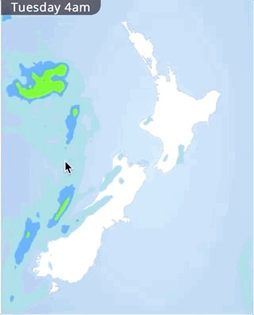

# Userscript for Niwa Weather Map

By default the [Niwa Weather Map](https://weather.niwa.co.nz/weathermap) shows its rain radar based on time. It's a very useful map, but it can be frustrating waiting for it to pass through the times you care about.

So this userscript lets you adjust the time how you'd like.  You can mouse over the map left to right to adjust the rain radar forward and back.

